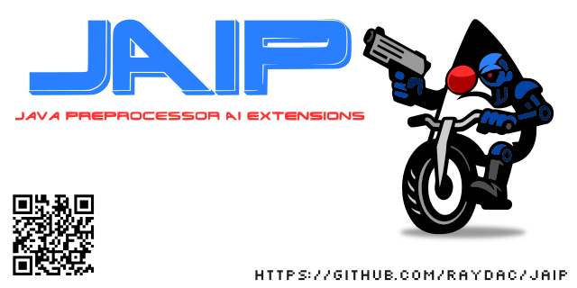

   
   
# Pre word

A long time ago, I created one of the first Java preprocessors (called JCP) to make building projects easier. The
preprocessor's business
is to read and change the program text. LLMs also work by generating text based on given input, so combining them with
a preprocessor is a logical step.

The JCP preprocessor allows you to keep blocks of text in comments, and starting from version 7.2.0, it can send them to
external services for processing. This gave me the idea to connect it with an LLM, so the result from the LLM could be
inserted directly into the program code (with minor normalizations).

Since the preprocessor can work with Maven, Gradle, and Ant, the ability to use LLMs automatically becomes available
for these build tools as well.

# How it works?

JAIP is a set of libraries that provide specialized services capable of calling external LLMs to process text. I’ve
added support for LLMs that have official open-source Java clients.
Currently, there are connectors for:

- Gemini AI (Google)
- Claude AI (Anthropic)
- ChatGPT (OpenAI)

To use one, you just need to add the corresponding library to the preprocessor’s classpath — the service will then
become
available for use. For better flexibility and compatibility, these libraries don’t include any client code themselves;
instead, they rely on a client library already present in the classpath.