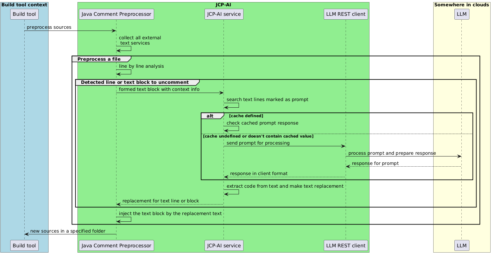

   
[](http://www.apache.org/licenses/LICENSE-2.0)
[](http://search.maven.org/#artifactdetails|com.igormaznitsa|jaip|1.0.0|jar)
[](http://www.oracle.com/technetwork/java/javase/downloads/index.html)
[](https://maven.apache.org/)

# Pre-word

A long time ago, I
created [one of the first Java preprocessors (called JCP)](https://github.com/raydac/java-comment-preprocessor) to make
building projects easier. The preprocessor's business is to read and change the program text. LLMs also work by
generating text based on given input, so combining them with a preprocessor is a logical step.

The JCP preprocessor allows you to keep blocks of text in comments, and starting from version 7.2.0, it can send them to
external services for processing. This gave me the idea to connect it with an LLM, so the result from the LLM could be
inserted directly into the program code (with minor normalizations).

Since the preprocessor can work with Maven, Gradle, and Ant, the ability to use LLMs automatically becomes available
for these build tools as well.

[](https://www.arthursacresanimalsanctuary.org/donate)

# How it works?

JAIP is a set of libraries that provide specialized services capable of calling external LLMs to process text. I’ve
added support for LLMs that have official open-source Java clients.   
Currently, it provides connectors for:

- [__Gemini AI__ (Google)](https://gemini.google.com/app)
- [__Claude AI__ (Anthropic)](https://claude.ai)
- [__ChatGPT__ (OpenAI)](https://chatgpt.com/)



The preprocessor discovers JAIP processors through Java's service registration mechanism, so it's enough for them to
appear in its classpath for them to become automatically available. For better flexibility and compatibility, JAIP
client
libraries don’t include any client code themselves; instead, they rely on a client library already present in the
classpath.

# Example for Maven

Let's take a look at a small example, how to inject a bit AI into a Maven project and get some its profit during build.

## Tune pom.xml

As the first step, we should tune the project pom.xml, inject [JCP](https://github.com/raydac/java-comment-preprocessor)
into build process and include JAIP. Let's use
Gemini AI as target LLM.   
The build section in the case should look like the snippet below:

```xml
<build>
    <plugins>
        <plugin>
            <groupId>com.igormaznitsa</groupId>
            <artifactId>jcp</artifactId>
            <version>7.2.1</version>
            <executions>
                <execution>
                    <id>preprocessSources</id>
                    <phase>generate-sources</phase>
                    <goals>
                        <goal>preprocess</goal>
                    </goals>
                    <configuration>
                        <allowBlocks>true</allowBlocks>
                        <preserveIndents>true</preserveIndents>
                        <vars>
                            <jaip.gemini.model>${jaip.gemini.model}</jaip.gemini.model>
                            <jaip.gemini.api.key>${jaip.gemini.api.key}</jaip.gemini.api.key>
                            <jaip.prompt.cache.file>${jaip.prompt.cache.file}</jaip.prompt.cache.file>
                        </vars>
                    </configuration>
                </execution>
            </executions>
            <dependencies>
                <dependency>
                    <groupId>com.google.genai</groupId>
                    <artifactId>google-genai</artifactId>
                    <version>1.9.0</version>
                </dependency>
                <dependency>
                    <groupId>com.igormaznitsa</groupId>
                    <artifactId>jaip-gemini</artifactId>
                    <version>1.0.0</version>
                </dependency>
            </dependencies>
        </plugin>
    </plugins>
</build>
```

Through the dependency section of the JCP plugin, we inject JAIP GeminiAI connector
and [its official REST client library](https://github.com/googleapis/java-genai). I specially don't include dependencies
to clients into JAIP connectors to change easily their version and don't keep dependency hard link between
dependencies.

## Inject prompt into sources

For work with prompts as text blocks I recommend you to turn on text block mode for JCP with flag `allowBlocks`, it
allows add some prompts directly into sources like below

```java
//$"""JAIP> code level is Java /*$mvn.project.property.maven.compiler.release$*/
//$"""JAIP> generate method implements fastest sort algorithm with minimal memory overhead, the speed is priority:
//$"""JAIP>     public static int [] fastSort(final int [] array, final boolean asc)
//$"""JAIP> where arguments are
//$"""JAIP>   int [] array is array to be sorted
//$"""JAIP>   asc is flag shows if true then ascending order for result, descending order otherwise
//$"""JAIP> it returns the same incoming array if it is null, empty or single value array, else returns new version of array with sorted values.
//$"""JAIP> the method should contain whole implementation of sort algorithm without any use of third side libraries, helpers and utility classes
//$"""JAIP> can't have additional methods and functions, all implementation must be as the single method
//$"""JAIP>
//$"""JAIP> special requirements and restrictions:
//$"""JAIP> 1. the method has javadoc header description
//$"""JAIP> 2. the method doesn't contain any internal method comment, only lines of code
//$"""JAIP> 3. don't use both single line comments and block comments inside the method code
//$"""JAIP> 4. if any import needed then use canonical class name and don't add import section
//$"""JAIP> 5. it is only method, must not have any class wrapping
//#-
public static int[] fastSort(final int[] array, final boolean asc) {
  throw new UnsupportedOperationException("not generated");
}
//#+
```

All sequent lines marked as `//$"""JAIP>` will be recognized as single prompt, they will be accumulated as text block
and provided to JAIP for processing. After processing, the result will fully replace the prompt text.
The result sources can be found in the maven project folder by path `target/generated-sources/preprocessed`.

## Tune JAIP

Requests to LLMs are not cheap, so I have provided way to cache their responses. We can provide JCP global variable
`jaip.prompt.cache.file` with path to caching file through preprocessor config and JAIP starts save gotten prompts in
the defined file as JSON. During every call it will be looking for already presented response for a prompt in the cache
and inject existing cached text if it is presented.

# JAIP parameters

All parameters of JAIP can be provided as local or global variables of JCP, in the plugin it is the `var` config
section.

## Common parameters

JAIP provides set of common parameters for all connectors:

- __jaip.prompt.cache.file__ - path to a cache file which contains prompt results in JSON format
- __jaip.prompt.only.processor__ - if multiple JAIP connectors detected as services then all they will be called for
  same prompt and their result will be accumulated, but this parameter allows to specify only connector which will
  be called in the case if needed.
- __jaip.prompt.temperature__ - float value to define __temperature__ for LLM process
- __jaip.prompt.timeout.ms__ - integer number of milliseconds for requests timeout, it will be provided directly
  to the calling REST client and its scope of responsibility
- __jaip.prompt.top.p__ - TopP parameter for LLM process if client supports it
- __jaip.prompt.top.k__ - TopK parameter for LLM process if client supports it
- __jaip.prompt.seed__ - Seed parameter for LLM process if client supports it
- __jaip.prompt.max.tokens__ - limit number for output tokens for LLM process if client supports it
- __jaip.prompt.instruction.system__ - text to be sent as system instruction with prompt, if not defined then default
  one will be sent

## Connector specific parameters

### Gemini AI

#### Maven dependency

```xml
<dependencies>
    <dependency>
        <groupId>com.igormaznitsa</groupId>
        <artifactId>jaip-gemini</artifactId>
        <version>1.0.0</version>
    </dependency>
    <dependency>
        <groupId>com.google.genai</groupId>
        <artifactId>google-genai</artifactId>
        <version>1.9.0</version>
    </dependency>
</dependencies>
```

#### Variables

- __jaip.gemini.base.url__ - base URL for REST calls, it will be provided for REST client
- __jaip.gemini.model__ - name of the model to be used for prompt processing
- __jaip.gemini.project.id__ - project id for authentication if needed
- __jaip.gemini.api.key__ - api key for authentication if needed
- __jaip.gemini.generate.content.config.json__ - string contains JSON config for generate content
- __jaip.gemini.http.config.json__ - string contain JSON config for client http options
- __jaip.gemini.client.options.json__ - string contain whole JSON config for client

### Anthropic

#### Maven dependency

```xml
<dependencies>
    <dependency>
        <groupId>com.igormaznitsa</groupId>
        <artifactId>jaip-anthropic</artifactId>
        <version>1.0.0</version>
    </dependency>
    <dependency>
        <groupId>com.anthropic</groupId>
        <artifactId>anthropic-java</artifactId>
        <version>2.2.0</version>
    </dependency>
</dependencies>
```

#### Variables

- __jaip.anthropic.base.url__ - base URL for REST calls, it will be provided for REST client
- __jaip.anthropic.model__ - name of the model to be used for prompt processing
- __jaip.anthropic.auth.token__ - authentication token if needed
- __jaip.anthropic.api.key__ - api key if needed

### OpenAI

#### Maven dependency

```xml
<dependencies>
    <dependency>
        <groupId>com.igormaznitsa</groupId>
        <artifactId>jaip-openai</artifactId>
        <version>1.0.0</version>
    </dependency>
    <dependency>
        <groupId>com.openai</groupId>
        <artifactId>openai-java</artifactId>
        <version>2.16.0</version>
    </dependency>
</dependencies>
```

#### Variables

- __jaip.openai.base.url__ - base URL for REST calls, it will be provided for REST client
- __jaip.openai.model__ - name of the model to be used for prompt processing
- __jaip.openai.project__ - name of a project to process prompt
- __jaip.openai.org.id__ - organization id used for authentication
- __jaip.openai.webhook.secret__ - webhook secret parameter if needed
- __jaip.openai.api.key__ - api key if needed
